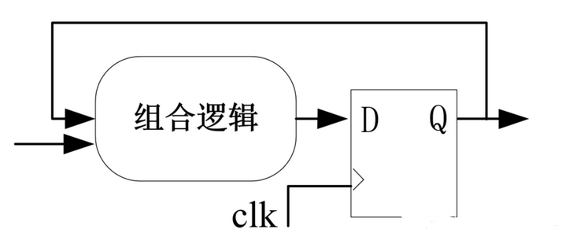

### Bugs

程序的终止端口0x30004，如果不先进行一次memory access, 会导致`io_en`一直是`x`电位。程序无法正常终止。

~~但似乎也必须要先读取指令~~🤡

### 我们为什么需要时序逻辑 or 时钟周期

- 消除组合逻辑运行速度不一而产生的毛刺
- 各个部件的状态需要同步，否则一些操作将无法完成，比如说pc = pc + 4

### 组合逻辑 or 时序逻辑 ？
- 组合逻辑块采用阻塞赋值，在综合上相当于assign，即时刻保持一个同步的关系
- 时序逻辑由组合电路和触发器组成，相当于阻塞了寄存器的同步状态，在特定时刻（比如说上升沿posedge)进行一个同步
- 每个周期从低电平到高电平，其中上升沿的时候会进行一个时序逻辑的同步，即将时序逻辑块运算的结果同步为当前状态（下图中Q为当前状态）。同步完后，直到下一个周期的上升沿，其余的组合逻辑电路部分有充足的时间进行运算，最终电路保持稳定。

- 组合逻辑不可以更改状态（例如往RS中issue一条指令必须要由时序控制）。

### 设计原则

~~之前的设计原则错了，刚好相反~~
- 时序块负责同步和一些信息的传递
- 如果增加时序阶段但是这些时序阶段是某种意义上的流水（可以被hide住），那么就应该这样写
- 增加的可以被hide住的时序块有利于增加cpu的频率，如果某个周期组合逻辑过多的话频率显然是上不去的

### 模块设计

##### IF

ppca里面并没有这个模块，这里的IF模块处理pc值的变化（ppca写在了ROB里面）。

- 得到执行后，下个周期发送给dispatcher，再下个周期RS/LSB可以处理这条指令了。
- 发送的同时pc寄存器也需要变化。
- 如何判断能不能发送？RS/LSB返回下个周期是否会是空的，所以需要在发送前就判断是发送到哪里的。

##### MC

- 输入地址发生变化后组合逻辑立马同步到内存接口
- 时序逻辑检测到开始读取后，开始一个byte一个byte的读取
- 得到内存接口的数据后，立马同步到临时寄存器（依次存储4个byte）
- 最后一个byte需要特判

##### ID

纯组合逻辑 decode + fetch register + send

##### ALU

运算器而已

##### ROB

##### RS

##### LSB
